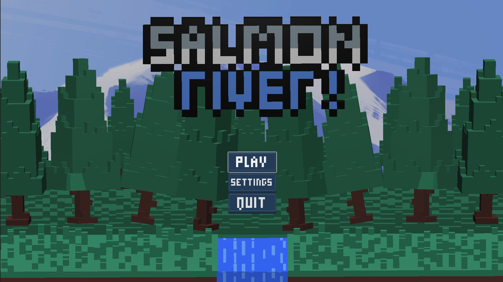
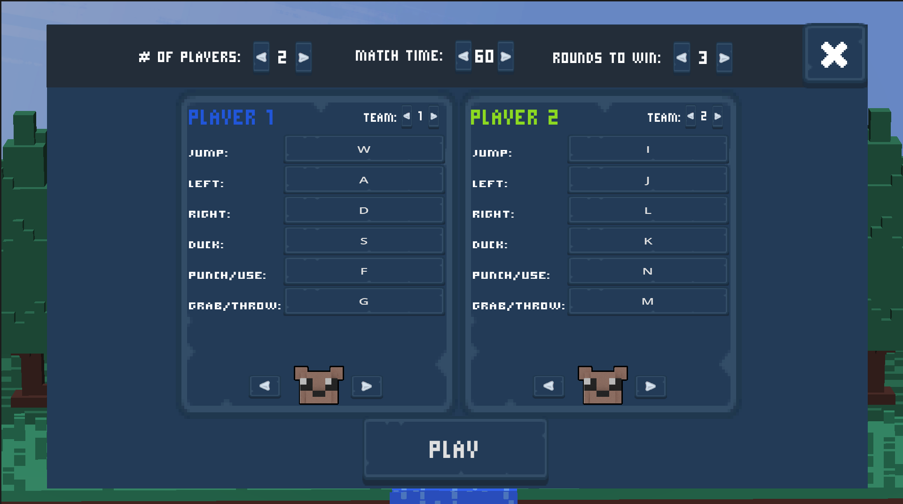
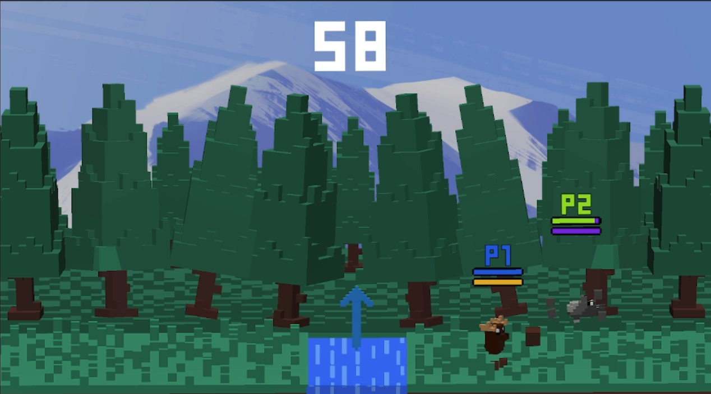
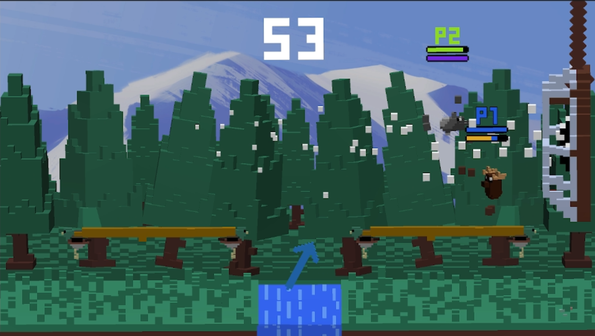
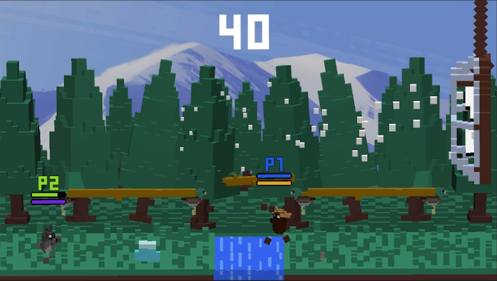
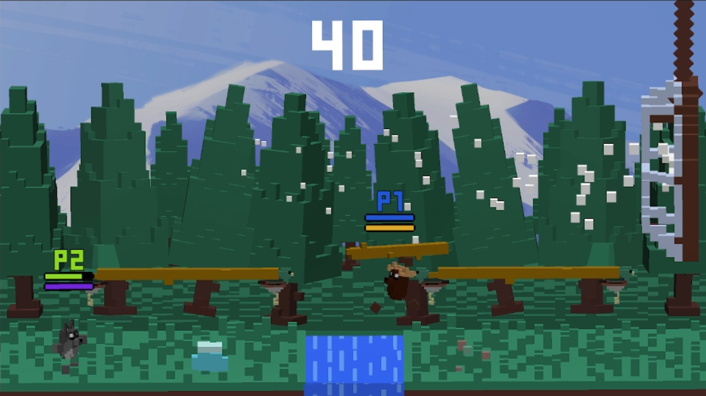

# The Salmon River

A local multiplayer arena brawler made in Godot 4 with a Rust GDExtension.
Up to 4 players pick an character, split into teams or go free-for-all, and fight it out in a river
arena to be the last bear standing! 
This was a learning project for me to get familiar with the Godot engine and the Rust GDExtension.

## Screenshots

|  1 |  2 |
| --- | --- |
|  |  |

| 3 | 4 |
| --- | --- |
|  |  |



## How to play

The game is played on one keyboard or on gamepads.  A flexible control-binding system allows for flexible controls. Each player picks an character and is put on a team before the match starts.

In a round you try to be the last one standing. The last team with a player
alive wins the round and gets a point. If the round timer runs out, the team
with the most health wins. 
Items will periodically jump out of the fast-flowing river! Catch them and use them or throw them at your enemies!

You win a round by using the arena against everyone else:
- **Punch!** other players to knock them back.
- **Grab and throw!** players, logs, ice chunks, and salmon.
- **Use Items!** punching while holding an items will trigger a unique ability for each item.
- **Jump!** onto platforms and **Duck!** under attacks and thrown items!
- **Grab rivals that keep ducking!** and throw them onto the saw blades for an instant kill.
- **Watch out for traps!** Platforms, saws, and fans appear during the round. Every few seconds the entire arena changes!

After the match, the leaderboard shows the final scores. Players vote on the
pressure plates to either rematch or return to the main menu.

## Standalone executable in the releases page!
## Building the project

The Godot project lives in `Godot/` and the game logic lives in Rust under
`Rust/the_salmon_river/`. Godot loads the compiled Rust library, so it has to be
built before the game will start.

1. Install [Godot 4](https://godotengine.org/download) and the
   [Rust toolchain](https://www.rust-lang.org/tools/install).
2. Build the Rust extension:

   ```sh
   cd Rust/the_salmon_river
   cargo build
   ```

   For a release build use `cargo build --release`.

3. Open the `Godot/` folder in Godot and run the project.

The main scene is `Godot/Scenes/main_menu.tscn`. `Godot/rust_run_extension.gdextension`
points at `target/debug` and `target/release`, so the build profile has to match
how you run Godot.

Useful extra checks:

```sh
cargo check
cargo clippy -- -D warnings
```

## Project layout

```text
Godot/                      Godot project: scenes, prefabs, art, shaders, audio
  Scenes/                   main_menu.tscn, main.tscn, victory_screen.tscn
  Prefabs/                  player, throwables, hazards, UI panels
  game_manager.tscn         Global game settings and save data
  audio_manager.tscn        Global audio and volume control
  rust_run_extension.gdextension   Loads the Rust library
Rust/the_salmon_river/      Rust game logic (godot-rust 0.5)
  src/game_managers/        game state, teams, rounds, input, saving, audio
  src/game_scripts/         players, matches, hazards, throwables, victory
  src/ui/                   menus, pre-match setup, settings, controls
```

The Rust code is registered into Godot as classes, so `GameManager`,
`RoundManager`, `MatchManager`, `Player`, and the rest are all Rust classes
attached to nodes in the scenes.
